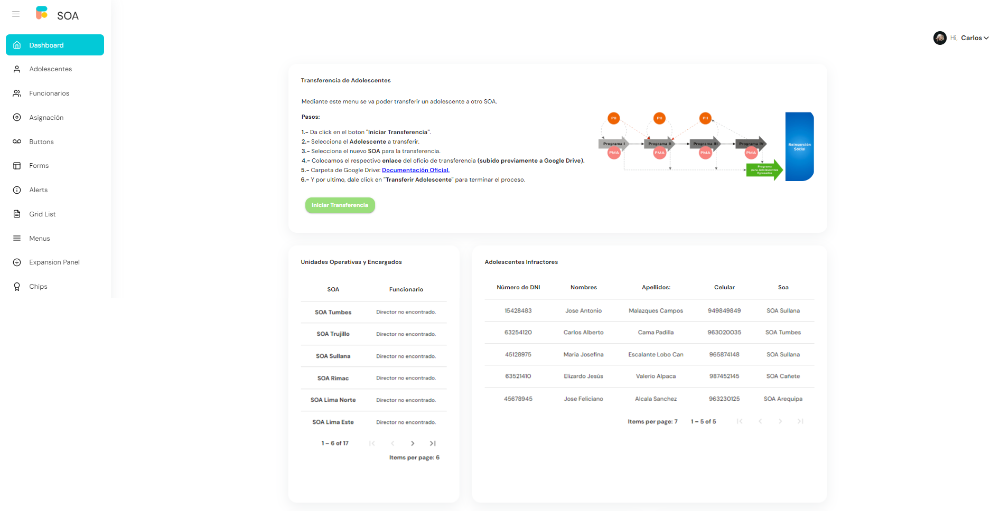
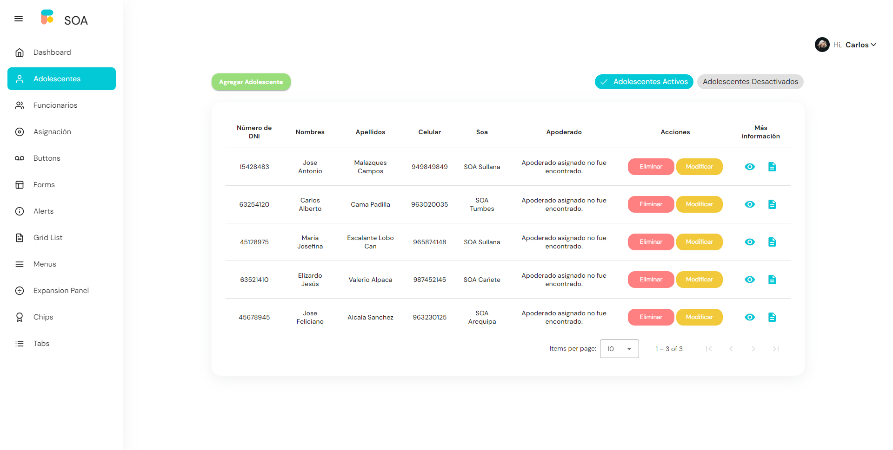
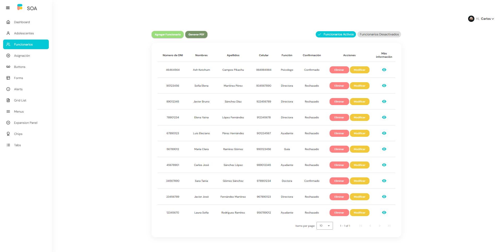

<h1>Microservicio Front-End:</h1>

 

Este repositorio va a contener el código concreto para la implementación y funcionamiento del microservicio del
Front-End, visualización de cada uno de los dashboard necesarios para poder utilizar los otros microservicios.

 

### Componentes necesario aplicables:

<ul>
    <li>Color del boton de registro: <strong>#9ADE7B</strong></li>
    <li>Color del boton de eliminado: <strong>#FF8080</strong></li>
    <li>Color del boton de modificación: <strong>#F1C93B</strong></li>
    <li>Color del boton de cancelación: <strong>#FF8080</strong></li>
</ul>

 

### Pagina principal | Dashboard:

<h6>Dentro de esta primera y principal dashboard, vamos a poder realizar la transferencia de un adolescente a un
distinto SOA que el de su creación.</h6>

### Dashboard Teen | Información:

<h6>En esta parte del dashboard hace todo el trabajo pero respecto solamente a la información del adolescente
infractor.</h6>

### Dashboard Funcionary | Información:

<h6>En esta parte del dashboard hace todo el trabajo pero respecto solamente a la información del funcionary del
SOA.</h6>

